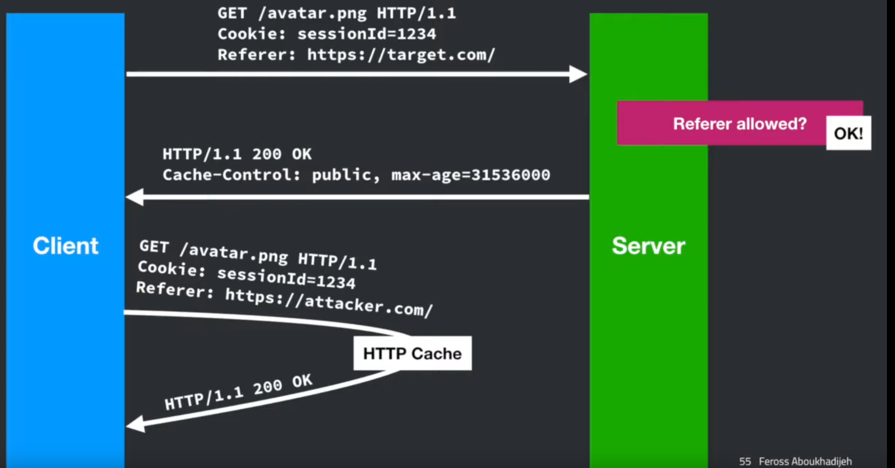

#### The `PostMessage` cross-origin communication

`postMessage` API 是 HTML5 中的一个功能，它允许在不同源的窗口之间进行通信。这个 API 可以用于实现跨文档消息传递（Cross-document messaging），也就是说，它可以用来在不同源（不同的协议、域名或端口）的浏览器窗口之间发送消息。

`postMessage` API 是双向的，这意味着它可以用于：

1. **发送消息**：一个窗口（源窗口）可以使用 `postMessage` 方法向另一个窗口（目标窗口）发送消息。发送的消息可以是字符串或者是一个可以被结构化克隆算法（Structured Clone Algorithm）处理的对象。

2. **接收消息**：目标窗口可以通过监听 `message` 事件来接收消息。当源窗口发送消息时，目标窗口的 `message` 事件处理器会被触发，并且可以访问到发送的消息内容。

这里是一个简单的例子，展示了如何使用 `postMessage` API：

**发送消息的窗口（源窗口）：**

```javascript
// 获取目标窗口的引用
var targetWindow = document.getElementById('myIframe').contentWindow;

// 发送消息
targetWindow.postMessage('Hello, World!', '*'); // 可以指定接收消息的源，'*' 表示任何源
```

**接收消息的窗口（目标窗口）：**

```javascript
// 监听 message 事件
window.addEventListener('message', function(event) {
  console.log('Received message:', event.data); // 打印接收到的消息

  // 检查消息来源
  if (event.origin !== 'http://example.com') {
    return; // 确保消息来自预期的源
  }

  // 可以回复消息
  event.source.postMessage('Message received!', event.origin);
});
```

请注意，使用 `postMessage` API 时，安全性是一个重要的考虑因素。你应该总是检查 `event.origin` 属性来确认消息是否来自一个可信的源，以避免潜在的安全风险。

validate source and destination of messages

#### Same origin policy exceptions
Embedded static resources such as images, scripts, styles.

#### Same origin policy exceptions + ambient authority

attacker.com 加载用户在社交媒体上的头像钓鱼。这里发生的是 CSRF. 可以设置 `SameSite=Lax` 或者 `SameSite=Strict` 来防御。 
```html
<h1> welcome to your account</h1>

```

Don't rely on referer. 



Another gotcha: 考虑转发了多次而且 Some sites can opt out of sending `Referer` header. Think about google doc. Some doc link should be kept secret.

再来一个post请求的例子，用`<form>`tag构造payload，然后在`<script>`tag中提交表单.
```html
<!doctype html>
<html>
    <title>my cool site</title>
    <form method='POST' action='bank.example.com/transfer' style='display: none;'>
        Send amount:
        <input name='amount' value='10'/>
        To user:
        <input name='to' value='bob'/> 
        <input type='submit' value='Send' />
    </form>
    <script>
        document.forms[0].submit()
    </script>
</html>
```

#### Cookies don't obey SOP

```
http://xxx.yyy.com:80/page/
|<-----origin------->|

origin = scheme + host + port
cookies care about domian and path but path is ineffective
```
- Cookies are less specific than Same Origin Policy:
Cookie of a website can be accessed by same or more specific domains. Different origins can mess with each others cookies (e.g. attacker.stanford.edu can set cookies for stanford.edu)
- Cookies are more specific than Same Origin Policy: `Path` is ineffective because same origin pages can access each other's DOMs (think about embedding a page as an iframe and then reading its the iframe's cookie. So use `httpOnly`!) 

#### Cross-Site Script Inclusion
  
Q: Can we configure Same Origin Policy? <br>
A: Yes.

Q: Prevent from linking to our website? (SEO, some sketchy sites link to me, I don't want this because I don't want google thinks my site is also sketchy) <br>
A: Cannot really do that. But can reject certain requests. 
```
GET / HTTP/1.1
Referer: https://competitor.com/
```
Notice the competitor may also don't want their `Referer` sent.
- `Referrer-Policy` HTTP header. 
  - `Referrer-Policy: no-referrer`
    - never send `Referer`
  - `Referrer-Policy: no-referrer-when-downgrade` 
    - send full URL. when HTTPS `to` HTTP, send nothing
  - `Referrer-Policy: origin`
    - send origin instead of full URL


Q: Prevent a site from embedding our website? (Why? clickhijack) <br>
Set `X-Frame-Options` HTTP Header in server response.
```
X-Frame-Options: deny
```
The browser (client side) denys response to the embeded frame when `X-Frame-Options: deny` is set in sercer response.

```
Browser ----------> attacker.com
        <---------

        ----------> target.com 
            ?-----
            X-Frame-Options: sameorigin

Embed allowed? 
           No!
```
What does `X-Frame-Options: sameorigin` actually mean?
- what should happen if target.com embeds othersite.com which target.com? Browsers performed a check only against top-level window
- attackers could set up a framing chain which would be allowed:
  `target.com` embeds `attacker.com` embeds `target.com`. But wait. Why would a legitimate site embeds malicious site? myspace embeds ad embeds myspace.

Q: Can we prevent other sites from submitting a from to our site? <br>
A: Why do this? Think about CSRF.
- Detect `Origin` header, use an allowlist at the server.
- Set `SameSite` cookies attr, so that cross site cookies won't be sent. (It doesn't prevent form submission, just removes the cookies)


Q: Can we precent a site from embedding images from our site? <br>
A: Why do this? 
  - prevent hotlinking, stole bandwidth. detect `Referer` header, use an allowlist on the server side (not foolproof)
  - prevent user's logged-in avatar from showing up on other sites? use `SameSite` cookies.

Is site A allowed to read data from site B? Important: embedding an image, script, or iframe is not "reading data". We could embed images, scripts, but not read the actual raw bytes in them. For iframes we couldn't access the DOM to read/write it.

`postMessage` API is one way.

Another is proxying or scripting.

JSONP: use `<script>` for cross-origin communication. 

```
site-b  --------------- ?callback=handleData -----------> site-a
        <-----handleData({'date': '2022-12-01'})--------
```

Downsides of JSONP:
- From site-a.com's perspective
  - need to write additional code to do padding
  - need to be careful: some valid JSON string are not legal javascript
  - need to sanitize user-provided callback argument (see reflected file download attack, injection)

- From site-b.com's perspective
  - only want to get data from site-a.com, but need to give site-a.com the ability to run arbitrary javascript. what if not return `handleData({'data': '2023-12-01'})` but `dangerous_function(xxx)`